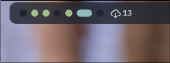
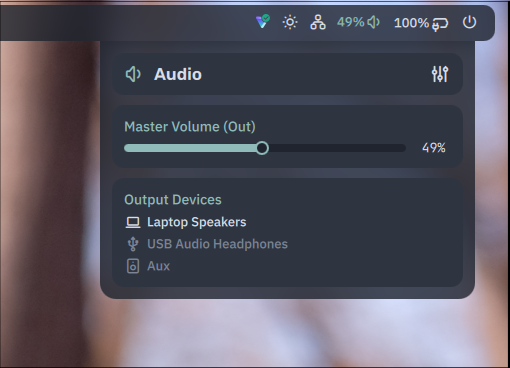

This repo contains my personal [Quickshell](https://quickshell.org/) configuration for Hyprland on Arch Linux. 

## Goals
- Most of the functionality expected from a complete desktop environment
- Information-dense while remaining unobtrusive and visually appealing
- Customizability through a config file and extensible design
- Reasonably low system resource usage


## Showcase







## Features
- [x] macOS/GNOME-like application dock
- [x] Status bar with widgets for:
    - [x] Clock
    - [x] Volume
    - [x] Battery
    - [x] Network
    - [x] Hyprland workspaces
    - [x] Brightness and blue light filter
    - [x] System package update reminders
    - [x] System tray (WIP, app icons render but are not yet interactive)
    - [ ] Bluetooth
    - [ ] Clipboard 
    - [ ] Caps-lock status
    - [ ] System resource monitoring
    - [ ] Local weather 
- [x] Menu system featuring: 
    - [x] Volume and audio device manager
    - [x] Display brightness and blue light filter controls
    - [ ] Network + Blueooth connection manager
    - [ ] Power/TDP profile manager
    - [ ] Calendar
    - [ ] Keyboard backlight
    - [ ] Media controls
- [x] Theming, including support for Matugen color generation from an image
- [x] OSD popups for volume, brightness, etc.
- [x] Sound effects (WIP)
- [x] Animations
- [ ] Session manager / logout overlay
- [ ] Centralized dashboard menu
- [ ] rofi-like app launcher
- [ ] Notification system
- [ ] Wallpaper manager
- [ ] IPC commands
github 

## Installation (Arch-based distros)

Dependencies:
```sh
noctalia-qs  # or quickshell
hyprland     # or hyprland-git
hyprsunset
pipewire
networkmanager
upower
matugen      # (optional, but the file Theme/Matugen.qml must be created)
```

Then, place the following somewhere in your Hyprland config:
```
layerrule = blur on, match:class quickshell
layerrule = blur_popups on, match:class quickshell 
layerrule = ignore_alpha 0.1, match:class quickshell
layerrule = no_anim on, match:class quickshell
```

I also recommend installing `menulibre` or an equivalent software for management of .desktop files which are used by the dock.

To run the shell, clone this repository then execute `quickshell -c /path/to/shell/` (replace with actual location)


## Customization
> I've made an effort for the project to be modular to some extent, but it is still primarily for my personal use and customization might not be the most friendly experience. `Config.qml` contains several options and is a good place to start.


### Project Structure

```sh
.
├── assets/               
├── components/           # Templates and reusable items
├── modules/              # Bundles related to a certain feature
│   └── module/           
│       ├── *Service.qml  # Backend logic for the module
│       ├── *Panel.qml    # Implementation of a Panel component
│       └── *Widget.qml   # Implementation of a BarWidget component 
├── style/                # Declaration of color themes, fonts, sounds
└── views/                # Top-level rendering and positioning 
```

## Acknowledgements

#### Design inspiration
- [Noctalia shell](https://github.com/noctalia-dev/noctalia-shell) 
- [end_4's Illogical Impulse](https://github.com/end-4/dots-hyprland)
- [rumda](https://github.com/Nytril-ark/rumda)
- macOS
- KDE Plasma 6

#### Code
- [end_4's Illogical Impulse](https://github.com/end-4/dots-hyprland) was a valuable reference for the network service scripts.

#### Other
- [Tabler](https://tabler.io/icons) icons
- [xZepyx's nucleus-shell](https://github.com/nucleus-hq/nucleus-shell) for being a good example which helped me with learning QML early on
- outfoxxed and other contributors for creating Quickshell and its documentation :)

